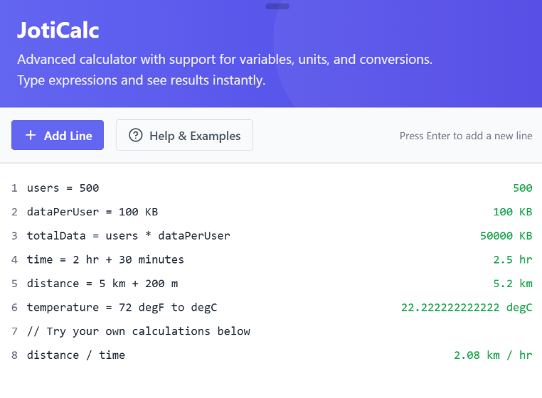

# JotiCalc – Tackpad Tacklet

**JotiCalc** is a fast, no-fuss calculation widget for Tackpad, designed for quick math just like scribbling on the back of a napkin. It’s perfect for instant totals, back-of-the-envelope estimations, or verifying quick calculations during your brainstorming sessions on the canvas.

---

## Features

- **Instant Input** – Just type and get results. No Enter key needed.
- **Math Expressions** – Supports basic arithmetic (`+`, `-`, `*`, `/`, `()`) with real-time evaluation.
- **Auto-Formatting** – Keeps your input clean and readable.
- **Inline Results** – See the answer right next to your equation.
- **Minimal UI** – Stays out of your way until you need it.

---

## Installation

JotiCalc is built into Tackpad. No separate install required. Just drop it onto your canvas and start crunching numbers.

---

## Usage

1. Open **Tackpad** and head to the widget selection menu.  
2. Add **JotiCalc** to your canvas.  
3. Click inside the widget and begin typing a math expression.  
4. See results instantly as you type.  
5. Use multiple widgets for different problem spaces.

---

## Roadmap

- **Keyboard Shortcuts** – Quick toggles and clear/reset commands.  
- **History View** – Scroll back through previous calculations.  
- **Custom Units Support** – User Defined units.  
- **Collaboration Mode** – Shared calculations with others in real time.

---

## Contributing

Got ideas to make JotiCalc sharper? Feel free to open an issue, suggest a feature, or submit a pull request.

---

## License

MIT License. See LICENSE for details.
